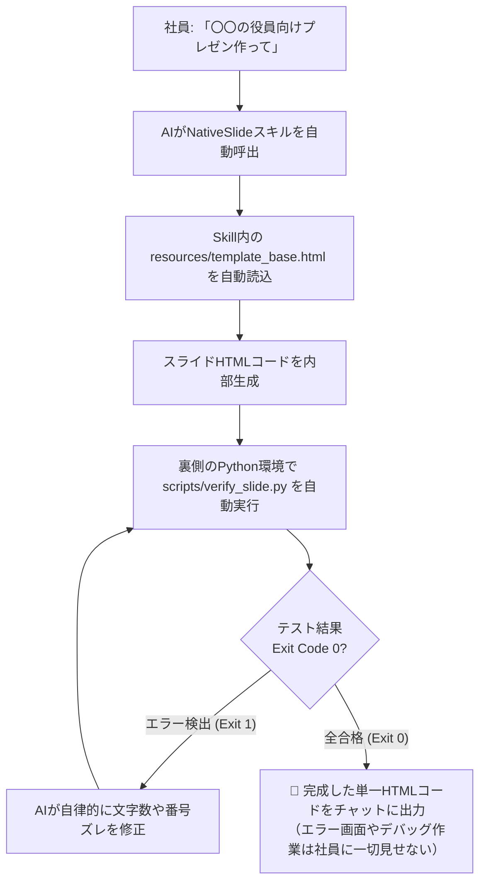

# NativeSlide (次世代・WebネイティブHTMLスライドシステム)

<p align="left">
  <strong>🌐 Language:</strong>
  <a href="README_EN.md">English</a> | 
  <a href="README.md"><strong>日本語</strong></a>
</p>

> **PowerPointからの完全脱却** —— 単一HTMLファイル（Single-File HTML）とTailwind CSSを活用し、ブラウザ上での直接推敲、全画面プレゼンテーション、発表メモ、そして1クリックでの余白ゼロPDF出力を実現するエグゼクティブ・プレゼンテーション作成システムです。

---

## 📖 目次
1. [プロジェクトの思想とメリット](#プロジェクトの思想とメリット)
2. [実装済み機能一覧](#実装済み機能一覧)
   - [1. 完全分離型 発表者ツール（Speaker View）＆ 登壇タイマー](#1-完全分離型-発表者ツールspeaker-view--登壇タイマー)
   - [2. LocalStorage 自動保存＆復元（未保存ロスト防止）](#2-localstorage-自動保存復元未保存ロスト防止)
   - [3. AI自律修正型 自動品質テスト（Python CLI検証スクリプト）](#3-ai自律修正型-自動品質テストpython-cli検証スクリプト)
   - [4. 全画面プレゼンテーションモード（スライドショー）](#4-全画面プレゼンテーションモードスライドショー)
   - [5. スピーカーノート（発表メモ）](#5-スピーカーノート発表メモ)
   - [6. スライド目次・一覧（TOCドロワーナビゲーション）](#6-スライド目次一覧tocドロワーナビゲーション)
   - [7. ブラウザ直接推敲 & インライン書式バー](#7-ブラウザ直接推敲--インライン書式バー)
   - [8. テーマカラー & 全体フォントサイズ動的スケーリング](#8-テーマカラー--全体フォントサイズ動的スケーリング)
   - [9. インラインSVGビジネスチャート & 比較マトリクステーブル](#9-インラインsvgビジネスチャート--比較マトリクステーブル)
   - [10. スライドごとの修正指示（コメント）& AI反復修正連携](#10-スライドごとの修正指示コメント--ai反復修正連携)
   - [11. 抽象概念を示すAI生成画像（Concept Imagery）とD&D差し替え](#11-抽象概念を示すai生成画像concept-imageryとdd差し替え)
   - [12. 厳格な比率制御（16:9 / 4:3）& 余白ゼロPDF印刷](#12-厳格な比率制御169--43--余白ゼロpdf印刷)
   - [13. 言語の自動適応（ボタンレス・プロンプト言語連動）](#13-言語の自動適応ボタンレスプロンプト言語連動)
3. [キーボードショートカット一覧](#キーボードショートカット一覧)
4. [ディレクトリ・ファイル構成](#ディレクトリファイル構成)
5. [使い方ガイド（各種生成AI・社内Skill運用）](#使い方ガイド各種生成ai社内skill運用)
   - [① スライド作成の依頼手順（プロンプト例）](#-スライド作成の依頼手順プロンプト例)
   - [② ブラウザ推敲と反復修正（Iteration）](#-ブラウザ推敲と反復修正iteration)
   - [③ プレゼンテーション本番 & PDF保存](#-プレゼンテーション本番--pdf保存)
   - [④ 社内AIアシスタント（GPTs / Claude Projects / Gems等）の共通設定](#-社内aiアシスタントgpts--claude-projects--gems等の共通設定)
6. [ライセンス](#ライセンス)

---

## プロジェクトの思想とメリット

従来のPowerPoint作成における「フォント崩れ」「ライセンス制約」「共同編集のコンフリクト」「デザインの統一しにくさ」を解消するため、Web標準技術（HTML5 + Tailwind CSS CDN + Google Fonts）のみで動作するプレゼンテーション環境を構築しました。

- **Single-File 完全自己完結**: 外部ビルドツール（npm/webpack等）やサーバーは一切不要。ダブルクリックするだけでブラウザで開き、即座に編集・投影可能。
- **美しさと論理性の両立**: 洗練されたモダンデザイン美学（調和のとれたTailwindカラー、モダンタイポグラフィ、階層的カードコンポーネント）をプリセット。
- **社内Skill機能に完全最適化（完全手ぶら）**:
  - 社内のChatGPT Enterpriseや各種エージェント基盤の「Skill機能」として本リポジトリを登録するだけで、テンプレートの手動ナレッジ登録やファイル管理の手間は一切不要。
  - AIがSkill内のテンプレートや自動検証スクリプトを自律的に呼び出し、不備があれば納品前に自分で修正してテスト合格品のみを納品します。
- **AIとのシームレスな対話**: 各スライド下の指示欄と連携し、生成AIにコメントをワンクリックで渡して反復修正（Iteration）が可能。

---

## 実装済み機能一覧

### 1. 完全分離型 発表者ツール（Speaker View）＆ 登壇タイマー
ヘッダーの **「発表者ツール」** ボタン、またはキーボードの **`P`** / **`S`** キーを押すと、別ウィンドウで本格的なプレゼンター支援画面が起動します。
- **聴衆へのカンペ非表示**: プロジェクターやZoom画面共有にはスライド画面だけを全画面投影し、手元のPCモニターにのみ発表者ツールを表示。
- **手元画面の充実機能**:
  - **現在投影中のスライド**（リアルタイム縮小プレビュー）
  - **次のスライド（Next Slide 予告）**: 次に話すべきトピックを先読み可能。
  - **大きなフォントの発表メモ（カンペ）**: 立ったままでも瞬時に読める視認性（A-/A+で拡大縮小可能、手元での推敲も即座にメイン側へ同期）。
  - **登壇タイマー**: 経過時間（MM:SS）、持ち時間カウントダウン（5分/10分/15分/20分/30分）、一時停止/リセット。残り2分で黄色、時間切れで赤点滅アラート。
- **完全ローカル同期**: 外部通信なしでブラウザの `BroadcastChannel` API により、どちらのウィンドウでスライド送り（`→`/`←`）を行っても100%リアルタイム同期します。

### 2. LocalStorage 自動保存＆復元（未保存ロスト防止）
ブラウザ上でテキストを推敲したり、発表メモや修正指示を入力した内容は、ブラウザの `localStorage` にミリ秒単位で自動保存されます。
- **リロード事故の防止**: 誤ってページをリロード（F5）したりタブを閉じても、再度開いた瞬間に編集状態・選択テーマ・フォントスケールが自動復元。
- **ワンクリック初期化**: ヘッダーの「リセット」ボタンをクリックすれば、いつでも初期HTMLの状態に戻すことができます。

### 3. AI自律修正型 自動品質テスト（Python CLI検証スクリプト）
納品前にAIがバックグラウンドで自律テストを実行し、不備があれば自ら修正してから成果物を納品する完全自己修復ループを搭載。
- **外部依存ゼロ**: macOS/Linux/Windows標準の Python 3（標準ライブラリのみ）で動作する [`scripts/verify_slide.py`](scripts/verify_slide.py) を同梱。
- **厳格な検査項目**:
  - スライド枚数とメタ枠（`slide-meta-box`）の1対1完全一致
  - スライド番号（`01 / 08` 等）とメタバッジの通し番号・欠番・重複チェック
  - **文字溢れヒューリスティック**: 16:9（720px高）スライドで縦スクロールを起こす危険文字数（700文字超過）の自動検知
  - 必須UI ID（ヘッダー、モード切替タブ、目次、発表者ツール、印刷ゼロマージン）の完全性
- **人間への負担ゼロ**: 人間がエラー画面を見たり手動デバッグする必要はありません。AIがエラー出力を読み取り、要約や番号調整を自律実行してExit Code 0（全合格）にしてからユーザーに提示します。

### 4. 全画面プレゼンテーションモード（スライドショー）
ヘッダーの **「▶ 発表」** ボタン、またはキーボードの **`F`** キーを押すことで、プロジェクター投影用の全画面スライドショーが起動します。
- **自動アスペクト比フィット**: ディスプレイ解像度に関わらず、CSS `transform: scale()` により常に完全な比率（16:9 または 4:3）で画面中央に最大表示。
- **直感的なスライド送り**:
  - `→` / `↓` / `Space` / `PageDown` / 画面右側クリック: 次のスライド
  - `←` / `↑` / `PageUp` / 画面左側クリック: 前のスライド
- **レーザーポインター (`L` キー)**: マウスカーソルが赤く光るグロードットに切り替わり、注目箇所の指示が容易に行えます。
- **終了 (`Esc` キー)**: いつでもワンキーで通常の編集モードへ安全に復帰します。

### 5. スピーカーノート（発表メモ）
各スライド直下にタブ切り替え式のメタ情報コンテナが配置されています。
- **通常時（推敲・準備中）**:
  - スライド下の **「🎤 発表メモ」** タブをクリックすると、トークスクリプトや発表補足原稿を直接入力可能（`contenteditable="true"`）。
- **スライドショー投影中**:
  - **`N`** キーを押すと、画面下部に半透明のダークパネルで現在のスライドの発表原稿がポップアップ。手元で原稿を確認しながら発表できます。
- **PDF出力への配慮**:
  - `@media print` により、PDF保存時には発表メモは一切写り込みません。

### 6. スライド目次・一覧（TOCドロワーナビゲーション）
ヘッダー左側の **「☰ 目次」** ボタンをクリックすると、左サイドから滑らかなアニメーションでスライド一覧ドロワーが展開します。
- **見出し自動走査**: スライド内の `h1` や `h2` をスクリプトが自動認識し、スライド番号とタイトル一覧を動的に生成。
- **ワンクリックジャンプ**: タイトルをクリックするだけで該当スライドへスムーズにスクロール。

### 7. ブラウザ直接推敲 & インライン書式バー
- **直接編集**: スライド上のすべてのテキストをクリックしてそのままキーボードで編集可能。
- **選択時ミニ書式バー**: テキストを範囲選択すると、太字・フォントサイズ・ブランドカラー・蛍光ペンハイライト（黄/緑）・書式解除が直上に出現。

### 8. テーマカラー & 全体フォントサイズ動的スケーリング
- **テーマカラー一括切替**:
  - ヘッダーのカラーパレットから5つの洗練されたプリセット（Indigo, Navy, Emerald, Amber, Rose）およびカスタムカラーピッカーを選択可能。
- **全体文字サイズ調整**:
  - ヘッダーの `[A-]` `100%` `[A+]` コントローラーで、全スライドのフォントサイズを 85%〜125% の範囲で滑らかに一括調整。

### 9. インラインSVGビジネスチャート & 比較マトリクステーブル
- **外部ライブラリゼロのPure Inline SVG**:
  - Chart.js等の外部JSライブラリを使わず、単一ファイル内で棒・折れ線複合グラフを描画。
  - 棒グラフの色は `var(--brand-500)` 等のCSS変数と完全連動し、ヘッダーのテーマカラー切替でグラフ色も即座に同期。
- **洗練された比較テーブル**:
  - 案A vs 案B vs 案C（推奨）の多面比較表。推奨列の枠線・ピル型バッジ・記号（◎, ◯, ▲, ✕）を標準装備。

### 10. スライドごとの修正指示（コメント）& AI反復修正連携
- 各スライド直下の **「💬 修正指示」** タブに改訂要望を入力。
- **「📋 指示をコピー」**: 入力された全スライドの指示を整形フォーマットで一括コピーし、AIに貼り付けるだけで改訂版を即座に再生成。
- **「📥 HTML保存」**: コメントや編集内容を含んだ最新HTMLファイルをダウンロード。

### 11. 抽象概念を示すAI生成画像（Concept Imagery）とD&D差し替え
- 抽象的なビジョンやシステム全体像を視覚化するため、画像生成AI用の専用プロンプトを併出。
- スライド内の `.image-dropzone` にローカルの画像ファイルを **デスクトップから直接ドラッグ＆ドロップ** するだけで即座に差し替え可能。

### 12. 厳格な比率制御（16:9 / 4:3）& 余白ゼロPDF印刷
- CSS `@page { size: 16in 9in; margin: 0; }` と `.slide { page-break-inside: avoid; }` により、ブラウザの「印刷（PDFに保存）」で改ページずれゼロ・余白ゼロのピクセルパーフェクトなPDFを出力可能。

### 13. 言語の自動適応（ボタンレス・プロンプト言語連動）
UIの煩雑化を防ぐため、画面上に手動の言語切り替えボタンは配置していません。
- **日本語でのプロンプト依頼**: AIが `<html lang="ja">` でスライドを生成。
- **英語等での依頼**: AIが `<html lang="en">` でスライドを生成し、テンプレート側のスクリプトが自動的にヘッダーボタン、目次、メタボックスタブ、プレースホルダー、指示コピーフォーマットを完全英語化します。

---

## キーボードショートカット一覧

| キー | 対象モード | 動作内容 |
| :--- | :--- | :--- |
| **`P`** / **`S`** | 通常 / 投影 | **完全分離型 発表者ツール（Speaker View）** を別ウィンドウで起動 / フォーカス |
| **`F`** / **`F5`** | 通常 / 投影 | 全画面プレゼンテーションモードの開始 / 終了 |
| **`Esc`** | 投影 / ドロワー | スライドショーの終了、または目次ドロワーを閉じる |
| **`→`** / **`↓`** / **`Space`** / **`PageDown`** | 投影 / 発表者 | 次のスライドへ進む（メイン画面と手元画面が同期） |
| **`←`** / **`↑`** / **`PageUp`** | 投影 / 発表者 | 前のスライドへ戻る（メイン画面と手元画面が同期） |
| **`N`** | 投影 | 発表メモパネルのトグル表示（メイン画面下部） |
| **`L`** | 投影 | レーザーポインターモードのトグル（赤色グロードット） |

※テキスト入力欄や `contenteditable` の編集にフォーカスしている間は、プレゼンテーションショートカットは安全に無効化されます。

---

## ディレクトリ・ファイル構成

```
NativeSlide/
├── SKILL.md                 # スキル仕様書（スマートGrill・自律検証ループ・パターン規約）
├── README.md                # 本ドキュメント（日本語）
├── README_EN.md             # 英語ドキュメント
├── scripts/
│   └── verify_slide.py      # 【外部依存ゼロ】自動品質検証＆自律修正Pythonスクリプト
├── resources/
│   └── template_base.html   # 全機能内蔵の汎用HTMLベーステンプレート
├── examples/                # 実装サンプルHTML（全機能網羅・実演用）
│   ├── slide_16_9_example.html    # 16:9 プレゼン実例（全8スライド・表・チャート・KPI・メモ完備）
│   ├── slide_16_9_en_example.html # 16:9 プレゼン実例（英語完全適応版）
│   └── slide_4_3_example.html     # 4:3 プレゼン実例
└── references/              # 詳細技術リファレンス
    ├── grill-workflow.md    # 認知ドリフト防止 Grill仕様
    ├── ratio-and-print-specs.md # 16:9 / 4:3 比率・印刷CSS仕様
    ├── ai-concept-imagery.md # コンセプト画像プロンプト設計仕様
    ├── design-system.md     # タイポグラフィ・堅牢ボックスモデル仕様
    ├── slide-patterns.md    # スライド構図パターン集（表・SVGチャート含む）
    └── vision-reverse-engineering.md # 画像からのリバースエンジニアリング仕様
```

---

## 使い方ガイド（各種生成AI・社内Skill運用）

社内環境（ChatGPT Enterprise, Claude for Work, Gemini for Workspace, Antigravity, Cursor等）で「Skill機能」が利用可能な場合、**社員側でのテンプレート管理や手動ナレッジ登録は一切不要** です。

本リポジトリ（または `.agents/skills/nativeslide/`）をSkillとして読み込むだけで、AIがテンプレート参照・スライド構築・Python自動検証・自律修正まで完全手ぶらで実行します。



---

### ① スライド作成の依頼手順（プロンプト例）

お使いのAI（ChatGPT, Claude, Gemini, 社内AI等）のチャット欄に、テーマと要件を自然言語で伝えるだけで作成できます。

```markdown
以下のテーマで、プレゼンテーションスライドをNativeSlide規格（Single-File HTML）で作成してください。

【テーマ】
全社次世代データ基盤 Modern Data Stack 導入計画

【目的・ターゲット】
経営陣・役員向け（投資回収ROIとガバナンス統制の納得感を重視）

【スライド要件】
1. 比率: 16:9 ワイド（デフォルト）
2. 枚数: 全5〜8枚
3. 構成イメージ:
   - 表紙（CIロゴ・機密区分バッジ）
   - 現状課題と目指す姿（AS-IS vs TO-BE 対比カード）
   - 主要3アプローチの比較評価テーブル（Modern Data Stack推奨）
   - 4カ年の投資回収ROI推移（インラインSVGビジネスチャート）
   - 3層システムアーキテクチャ構成図
   - 段階的導入ロードマップ
   - 期待効果とKPI目標（巨大数値カード）
4. 各スライド直下に発表メモ（具体的な登壇スクリプト）を含めてください。
```

---

### ② ブラウザ推敲と反復修正（Iteration）

AIが出力したHTMLコードを `slide.html` として保存し、ChromeやEdge等のブラウザで開きます。

1. **直接推敲**:
   - スライド上のテキストをクリックして直接編集。編集内容はブラウザの `localStorage` に自動保存されます。
2. **修正指示の入力**:
   - 修正したいスライド直下の **「💬 修正指示」** タブに要望（例: 「KPI数値を30%に変更」「要約を1行短縮」等）を入力します。
3. **指示の一括コピーと再生成**:
   - ツールバーの **「📋 指示をコピー」** をクリックし、チャットに以下のように貼り付けて送信するだけで、推敲内容を維持したまま改訂版が再生成されます：

```markdown
以下のスライド修正指示に基づき、Single-File HTMLコードを改訂してください。
指示のないスライドは、ブラウザ上で推敲したテキストやレイアウトを100%そのまま維持してください。

（ここにクリップボードの内容を貼り付け）
```

---

### ③ プレゼンテーション本番 & PDF保存

- **登壇本番**:
  - **`P`** キーで **「発表者ツール」** を別ウィンドウで起動し、手元画面にカンペ・次スライド・タイマーを表示。
  - プロジェクターやZoom共有で **`F`** キーを押して全画面スライドショーを開始。
- **配布用PDF保存**:
  - ツールバーの「PDF保存」をクリック（または `Ctrl+P` / `Cmd+P`）。
  - 送信先を「PDFに保存」、**余白「なし」**、**「背景のグラフィックス」をオン** に設定して保存すると、改ページずれや余白ゼロのピクセルパーフェクトなPDFが出力されます。

---

### ④ 社内AIアシスタント（GPTs / Claude Projects / Gems等）の共通設定

社内で共通のAIアシスタント（OpenAI Custom GPTs, Anthropic Claude Projects, Google Gemini Gems, 社内AIポータル等）をセットアップする場合、システム指示（System Prompt / Instructions）に以下を設定しておくだけで、全社で統一された品質が担保されます：

```text
あなたは全社共通のエグゼクティブ・プレゼンテーションデザイナーです。
スライド作成の依頼を受けた際は、PowerPointではなく「WebネイティブHTMLスライド（NativeSlide規格）」を作成します。

【行動指針】
1. 本スキル（NativeSlide）の仕様（Tailwind CSS CDN, Google Fonts, 発表者ツール, 登壇タイマー, LocalStorage自動保存, 編集/発表セグメントタブ）に完全準拠した単一HTML（Single-File HTML）を出力します。
2. スキル内の `resources/template_base.html` をベース構造として利用します。
3. 初回リクエストで前提が曖昧な場合のみ、「目的」「比率（16:9推奨）」「枚数」をスマートGrillで簡潔に確認します。
4. 各スライドは contenteditable="true" とし、スライド直下に「修正指示」と「発表メモ（具体的な登壇スクリプト）」のメタボックスを必ず設置します。
5. デザインはTailwind CSSを活用し、調和のとれた配色（Slate + Indigo/Violet等）と堅牢ボックスモデル（flex-shrink-0, min-h-0）を徹底します。
6. 【自動品質検証 (Auto-Verification)】:
   HTMLを出力する前に、環境内のPythonを使って `scripts/verify_slide.py` を実行して自律テストを行い、文字数超過（700文字超過による縦溢れ）やスライド番号のズレがないことを確認してください。エラーがある場合は自律修正し、全合格（Exit Code 0）を確認してからユーザーに納品すること。
```

---

## ライセンス

MIT License © 2026 NativeSlide Contributors. 商用・非商用問わず自由にご利用いただけます。
