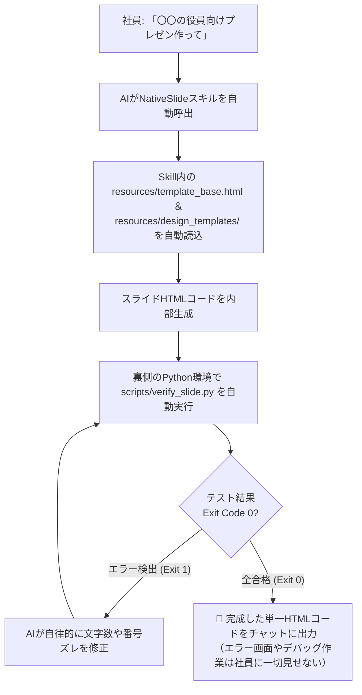

# NativeSlide (生成AIのための安定・高精度なHTMLスライド出力フレームワーク)

<p align="left">
  <strong>🌐 Language:</strong>
  <a href="README_EN.md">English</a> | 
  <a href="README.md"><strong>日本語</strong></a>
</p>

> **AIにスライドを作らせるなら、PPTXではなくHTML** —— LLMが最も得意とするHTML/Tailwind CSSを中間フォーマットとして活用し、レイアウト崩れや文字溢れのない堅牢なスライドを安定生成。最終的には余白ゼロのピクセルパーフェクトなPDFとしてエクスポートする、AI出力安定化フレームワークです。

<p align="left">
  <a href="https://xitakse.github.io/NativeSlide/">
    
  </a>
  <a href="https://github.com/XitakSE/NativeSlide/blob/main/LICENSE">
    
  </a>
</p>


---

## 📖 目次
1. [プロジェクトの思想とメリット](#プロジェクトの思想とメリット)
2. [実装済み機能一覧](#実装済み機能一覧)
   - [1. AI自律修正型 自動品質テスト（Python CLI検証スクリプト）](#1-ai自律修正型-自動品質テストpython-cli検証スクリプト)
   - [2. 強制文字溢れ防止（Line-Clamping）＆堅牢ボックスモデル](#2-強制文字溢れ防止line-clamping堅牢ボックスモデル)
   - [3. ヘッドレスPDF自動生成CLI（Puppeteer）](#3-ヘッドレスpdf自動生成clipuppeteer)
   - [4. LocalStorage バックグラウンド自動保存＆復元（未保存ロスト防止）](#4-localstorage-バックグラウンド自動保存復元未保存ロスト防止)
   - [5. 全画面プレゼンテーションモード（スライドショー）](#5-全画面プレゼンテーションモードスライドショー)
   - [6. ブラウザ直接推敲 & 編集モードトグル（OFF時選択禁止）](#6-ブラウザ直接推敲--編集モードトグルoff時選択禁止)
   - [7. 企業公式デザインテンプレート（CI/VI統一・自社PPTX連携）](#7-企業公式デザインテンプレートcivi統一自社pptx連携)
   - [8. インラインSVGビジネスチャート & 比較マトリクステーブル](#8-インラインsvgビジネスチャート--比較マトリクステーブル)
   - [9. スライドごとの修正指示（コメント）& AI反復修正連携](#9-スライドごとの修正指示コメント-ai反復修正連携)
   - [10. 抽象概念を示すAI生成画像（Concept Imagery）とD&D差し替え](#10-抽象概念を示すai生成画像concept-imageryとdd差し替え)
   - [11. 厳格な比率制御（16:9 / 4:3）& 余白ゼロPDF印刷](#11-厳格な比率制御169--43--余白ゼロpdf印刷)
   - [12. 言語の自動適応（ボタンレス・プロンプト言語連動）](#12-言語の自動適応ボタンレスプロンプト言語連動)
3. [削除された機能と再実装について](#削除された機能と再実装について)
4. [キーボードショートカット一覧](#キーボードショートカット一覧)
5. [ディレクトリ・ファイル構成](#ディレクトリファイル構成)
6. [スキルの導入方法（インストール）](#スキルの導入方法インストール)
7. [使い方ガイド（各種生成AI・社内Skill運用）](#使い方ガイド各種生成ai社内skill運用)
   - [① スライド作成の依頼手順（プロンプト例）](#-スライド作成の依頼手順プロンプト例)
   - [② ブラウザ推敲と反復修正（Iteration）](#-ブラウザ推敲と反復修正iteration)
   - [③ プレゼンテーション本番 & PDF保存](#-プレゼンテーション本番--pdf保存)
   - [④ 社内AIアシスタント（GPTs / Claude Projects / Gems等）の共通設定](#-社内aiアシスタントgpts--claude-projects--gems等の共通設定)
8. [ライセンス](#ライセンス)


---

## プロジェクトの思想

`python-pptx` 等でPPTXを直接生成させるとテキスト溢れ・フォント崩れが頻発し、Markdownスライドツール（Marp等）は構図の自由度に制約があります。**「LLMにとって最も記述精度が高く、レイアウトの自由度が高い出力形式は HTML + Tailwind CSS である」** という事実に着目し、HTMLを中間フォーマットとして活用することで出力を安定化させるアプローチを採用しました。

- **AI出力の安定性が最優先**: CSS Flexbox/Gridの自己修復的なレイアウトと `line-clamp` による強制的な文字溢れ防止により、AIがどんな長さのテキストを出力しても物理的にスライド枠を突き抜けません。
- **自律品質検証ループ**: Pythonスクリプトによる自動テストをAIが自律実行し、不備があれば納品前に自己修正。人間がエラーを確認する必要は一切ありません。
- **Single-File 完全自己完結**: 外部ビルドツール（npm/webpack等）やサーバーは一切不要。ダブルクリックするだけでブラウザで開き、即座に編集・PDF出力可能。
- **社内Skill機能に完全最適化**: AIエージェント基盤の「Skill機能」として登録するだけで、テンプレート参照・スライド構築・自動検証まで完全手ぶらで実行します。
- **AIとのシームレスな反復修正**: 各スライド下の指示欄と連携し、生成AIにコメントをワンクリックで渡して改訂版を即座に再生成可能。

---

## 実装済み機能一覧

### 1. AI自律修正型 自動品質テスト（Python CLI検証スクリプト）
納品前にAIがバックグラウンドで自律テストを実行し、不備があれば自ら修正してから成果物を納品する完全自己修復ループを搭載。
- **外部依存ゼロ**: macOS/Linux/Windows標準の Python 3（標準ライブラリのみ）で動作する [`scripts/verify_slide.py`](scripts/verify_slide.py) を同梱。
- **厳格な検査項目**:
  - スライド枚数とメタ枠（`slide-meta-box`）の1対1完全一致
  - スライド番号（`01 / 08` 等）とメタバッジの通し番号・欠番・重複チェック
  - **文字溢れヒューリスティック**: 16:9（720px高）スライドで縦スクロールを起こす危険文字数（700文字超過）の自動検知
  - 必須UI ID（ヘッダー、プレゼンモーダル、印刷ゼロマージン）の完全性
- **人間への負担ゼロ**: 人間がエラー画面を見たり手動デバッグする必要はありません。AIがエラー出力を読み取り、要約や番号調整を自律実行してExit Code 0（全合格）にしてからユーザーに提示します。

### 2. 強制文字溢れ防止（Line-Clamping）＆堅牢ボックスモデル
AIが長文を出力してもレイアウトが崩れないための物理的な安全装置を内蔵。
- **`ai-content` コンテナ規約**: スライド本文エリアを `<div class="ai-content">` で囲み、構造をシンプルに規約化。
- **CSS Line Clamping**: 各見出し（2行制限）、本文段落（6行制限）、箇条書きリスト（3行制限）に `-webkit-line-clamp` と `overflow: hidden` を適用。スライド枠（720px）を突き抜けることなく自動で三点リーダー化されます。

### 3. ヘッドレスPDF自動生成CLI（Puppeteer）
ブラウザの印刷ダイアログを手動で開くことなく、コマンドラインから1行で余白ゼロのPDFを直接出力可能。
- [`scripts/export_pdf.js`](scripts/export_pdf.js) により、AIエージェントがスライド作成後に自動でPDFを生成してユーザーに届ける完全自律フローを構築できます。

### 4. LocalStorage バックグラウンド自動保存＆復元（未保存ロスト防止）
ブラウザ上でテキストを推敲したり、発表メモや修正指示を入力した内容は、ブラウザの `localStorage` にバックグラウンドで自動保存されます。
- **リロード事故の防止**: 誤ってページをリロード（F5）したりタブを閉じても、再度開いた瞬間に編集状態が自動復元されます。

### 5. 全画面プレゼンテーションモード（スライドショー）
ヘッダーの **「▶ 全画面発表」** ボタン、またはキーボードの **`F`** キーを押すことで、プロジェクター投影用の全画面スライドショーが起動します。
- **自動アスペクト比フィット**: ディスプレイ解像度に関わらず、CSS `transform: scale()` により常に完全な比率（16:9 または 4:3）で画面中央に最大表示。
- **直感的なスライド送り**:
  - `→` / `↓` / `Space` / `PageDown` / 画面右側クリック: 次のスライド
  - `←` / `↑` / `PageUp` / 画面左側クリック: 前のスライド
- **終了 (`Esc` キー)**: いつでもワンキーで通常の編集モードへ安全に復帰します。

### 6. ブラウザ直接推敲 & 編集モードトグル（OFF時選択禁止）
- **直接編集 & 選択時ミニ書式バー**: 編集モードON時はスライド上のテキストをクリックして直接推敲可能。範囲選択時に太字・フォントサイズ（個別調整）・マーカー・書式解除が出現します。
- **編集モードOFF（閲覧専用）**: ヘッダーのボタンまたはキーボードの **`E`** キーで切り替え。OFF時は `user-select: none; pointer-events: none;` により、スライド上の各要素がそもそも選択・クリックできなくなり、誤操作を防ぎます。

### 7. 企業公式デザインテンプレート（CI/VI統一・自社PPTX連携）
社員ごとの色ブレやデザイン崩れを防ぐため、安易なテーマカラー変更機能はあえて撤廃し、会社規定のブランドデザインを厳格に固定化。
- **デザイン骨格の分離**: [`resources/design_templates/corporate_default.html`](./resources/design_templates/corporate_default.html) に企業ロゴ、CIカラー、機密区分バッジ、定位置フッターを定義。
- **自社PPTXテンプレートからの移行**: 会社公式のPPTXやスライド画像をお持ちの場合、初期セットアップ専用スキル [nativeslide-template-builder](https://github.com/XitakSE/NativeSlide-Template-Builder) を利用して一度変換・登録するだけで、全社共通の公式デザインでスライドが量産されます。

### 8. インラインSVGビジネスチャート & 比較マトリクステーブル
- **外部ライブラリゼロのPure Inline SVG**:
  - Chart.js等の外部JSライブラリを使わず、単一ファイル内で美しい棒・折れ線複合ビジネスチャートを描画。
- **洗練された比較テーブル**:
  - 案A vs 案B vs 案C（推奨）の多面比較表。推奨列の枠線・ピル型バッジ・記号（◎, ◯, ▲, ✕）を標準装備。

### 9. スライドごとの修正指示（コメント）& AI反復修正連携
- 各スライド直下の **「💬 修正指示」** タブに改訂要望を入力。
- **「📋 指示をコピー」**: 入力された全スライドの指示を整形フォーマットで一括コピーし、AIに貼り付けるだけで改訂版を即座に再生成。
- **「📥 HTML保存」**: コメントや編集内容を含んだ最新HTMLファイルをダウンロード。

### 10. 抽象概念を示すAI生成画像（Concept Imagery）とD&D差し替え
- 抽象的なビジョンやシステム全体像を視覚化するため、画像生成AI用の専用プロンプトを併出。
- スライド内の `.image-dropzone` にローカルの画像ファイルを **デスクトップから直接ドラッグ＆ドロップ** するだけで即座に差し替え可能。

### 11. 厳格な比率制御（16:9 / 4:3）& 余白ゼロPDF印刷
- CSS `@page { size: 16in 9in; margin: 0; }` と `.slide { page-break-inside: avoid; }` により、ブラウザの「印刷（PDFに保存）」で改ページずれゼロ・余白ゼロのピクセルパーフェクトなPDFを出力可能。

### 12. 言語の自動適応（ボタンレス・プロンプト言語連動）
UIの煩雑化を防ぐため、画面上に手動の言語切り替えボタンは配置していません。
- **日本語でのプロンプト依頼**: AIが `<html lang="ja">` でスライドを生成。
- **英語等での依頼**: AIが `<html lang="en">` でスライドを生成し、テンプレート側のスクリプトが自動的にヘッダーボタン、メタボックスタブ、プレースホルダー、指示コピーフォーマットを完全英語化します。

---

## 削除された機能と再実装について
以下の機能はAI出力安定性を最優先する設計方針に基づき、テンプレートの軽量化（トークン数削減）のために現行テンプレートから除去されました。旧テンプレートは `legacy/template_base_full_features.html` として保管されています。ニーズがある場合は、このバックアップを参照して再実装を検討できます。

| 削除した機能 | 削除理由 |
| :--- | :--- |
| 完全分離型 発表者ツール（Speaker View）＆ 登壇タイマー | BroadcastChannel通信ロジックがJSコード量を大幅に増大させ、AI生成時のトークン消費・エラー率に影響 |
| レーザーポインター | PDF出力前提の設計において不要なギミック |
| 目次ドロワーナビゲーション | 動的DOM走査JSが重く、PDF出力時には不要なUI要素 |

---

## キーボードショートカット一覧

| キー | 対象モード | 動作内容 |
| :--- | :--- | :--- |
| **`F`** / **`F5`** | 通常 / 投影 | 全画面プレゼンテーションモードの開始 / 終了 |
| **`E`** | 通常 / 投影 | 編集モードのON / OFF切り替え |
| **`Esc`** | 投影 | スライドショーの終了（通常編集モードへ復帰） |
| **`→`** / **`↓`** / **`Space`** / **`PageDown`** | 投影 | 次のスライドへ進む |
| **`←`** / **`↑`** / **`PageUp`** | 投影 | 前のスライドへ戻る |
| **`Home`** / **`End`** | 投影 | 最初 / 最後のスライドへジャンプ |

※テキスト入力欄や `contenteditable` の編集にフォーカスしている間は、プレゼンテーションショートカットは安全に無効化されます。

---

## ディレクトリ・ファイル構成

```
NativeSlide/
├── SKILL.md                 # スキル仕様書（スマートGrill・自律検証ループ・パターン規約）
├── README.md                # 本ドキュメント（日本語）
├── README_EN.md             # 英語ドキュメント
├── scripts/
│   ├── verify_slide.py      # 【外部依存ゼロ】自動品質検証＆自律修正Pythonスクリプト
│   └── export_pdf.js        # Puppeteerによるヘッドレス余白ゼロPDF自動生成CLI
├── resources/
│   ├── template_base.html   # 汎用HTMLベーステンプレート（機能エンジン）
│   └── design_templates/    # 企業公式デザインテンプレート群（CI/VI統一）
│       └── corporate_default.html # 標準コーポレートデザイン（CIカラー/ロゴ/枠固定）
├── examples/                # 実装サンプルHTML
│   └── slide_16_9_example.html    # 16:9 プレゼン実例（全8スライド・表・チャート完備）
├── legacy/                  # 削除済み機能のバックアップ
│   └── template_base_full_features.html  # 発表者ツール・目次ドロワー等を含む旧テンプレート
└── references/              # 詳細技術リファレンス
    ├── grill-workflow.md    # 認知ドリフト防止 Grill仕様
    ├── ratio-and-print-specs.md # 16:9 / 4:3 比率・印刷CSS仕様
    ├── ai-concept-imagery.md # コンセプト画像プロンプト設計仕様
    ├── design-system.md     # タイポグラフィ・堅牢ボックスモデル仕様
    └── slide-patterns.md    # スライド構図パターン集（表・SVGチャート含む）
```

※自社公式のPPTXやスライド画像からデザインテンプレートを生成して `resources/design_templates/` に登録する作業は、初期セットアップ専用スキル [nativeslide-template-builder](https://github.com/XitakSE/NativeSlide-Template-Builder) で実行できます。

---

## スキルの導入方法（インストール）

Antigravity、Claude Code、Cursor等のAIエージェント環境では、リポジトリを `.agents/skills/` 配下に配置することで、スキルとして自動認識されます。

### 方法1. Git Clone による導入（推奨）

```bash
git clone https://github.com/XitakSE/NativeSlide.git .agents/skills/nativeslide
```

### 方法2. ZIPダウンロードによる直接配置（社内プロキシ制限環境・Git CLI不要）

社内セキュリティポリシーにより `git clone` が禁止されている場合や、GitがインストールされていないPCでも利用できます。

1. GitHubリポジトリ（[NativeSlide](https://github.com/XitakSE/NativeSlide)）の **「<> Code」➔「Download ZIP」** からZIPファイルを保存。
2. ZIPファイルを解凍。
3. 解凍したフォルダ（`NativeSlide-main`）を `nativeslide` にリネームし、作業スペースの `.agents/skills/nativeslide` に直接配置します。
   *(※ フォルダ直下に `SKILL.md` がある状態にしてください)*

---

## 使い方ガイド（各種生成AI・社内Skill運用）


社内環境（ChatGPT Enterprise, Claude for Work, Gemini for Workspace, Antigravity, Cursor等）で「Skill機能」が利用可能な場合、**社員側でのテンプレート管理や手動ナレッジ登録は一切不要** です。

本リポジトリ（または `.agents/skills/nativeslide/`）をSkillとして読み込むだけで、AIがテンプレート参照・スライド構築・Python自動検証・自律修正まで完全手ぶらで実行します。



---

### ① スライド作成の依頼手順（プロンプト例）

お使いのAI（ChatGPT, Claude, Gemini, 社内AI等）のチャット欄に、テーマと要件を自然言語で伝えるだけで作成できます。

```markdown
以下のテーマで、プレゼンテーションスライドをNativeSlide規格（Single-File HTML）で作成してください。

【テーマ】
全社次世代データ基盤 Modern Data Stack 導入計画

【目的・ターゲット】
経営陣・役員向け（投資回収ROIとガバナンス統制の納得感を重視）

【スライド要件】
1. 比率: 16:9 ワイド（デフォルト）
2. 枚数: 全5〜8枚
3. 構成イメージ:
   - 表紙（CIロゴ・機密区分バッジ）
   - 現状課題と目指す姿（AS-IS vs TO-BE 対比カード）
   - 主要3アプローチの比較評価テーブル（Modern Data Stack推奨）
   - 4カ年の投資回収ROI推移（インラインSVGビジネスチャート）
   - 3層システムアーキテクチャ構成図
   - 段階的導入ロードマップ
   - 期待効果とKPI目標（巨大数値カード）
4. 各スライド直下に発表メモ（具体的な登壇スクリプト）を含めてください。
```

---

### ② ブラウザ推敲と反復修正（Iteration）

AIが出力したHTMLコードを `slide.html` として保存し、ChromeやEdge等のブラウザで開きます。

1. **直接推敲**:
   - スライド上のテキストをクリックして直接編集。編集内容はブラウザの `localStorage` に自動保存されます。
2. **修正指示の入力**:
   - 修正したいスライド直下の **「💬 修正指示」** タブに要望（例: 「KPI数値を30%に変更」「要約を1行短縮」等）を入力します。
3. **指示の一括コピーと再生成**:
   - ツールバーの **「📋 指示をコピー」** をクリックし、チャットに以下のように貼り付けて送信するだけで、推敲内容を維持したまま改訂版が再生成されます：

```markdown
以下のスライド修正指示に基づき、Single-File HTMLコードを改訂してください。
指示のないスライドは、ブラウザ上で推敲したテキストやレイアウトを100%そのまま維持してください。

（ここにクリップボードの内容を貼り付け）
```

---

### ③ プレゼンテーション本番 & PDF保存

- **全画面スライドショー**:
  - プロジェクター投影やZoom画面共有で **`F`** キー（またはヘッダーの「▶ 発表」ボタン）を押して全画面スライドショーを開始。
  - `→` / `Space` でスムーズにスライド送り、`Esc` で通常画面へ戻ります。
- **配布用PDF保存**:
  - ツールバーの「PDF保存」をクリック（または `Ctrl+P` / `Cmd+P`）。
  - 送信先を「PDFに保存」、**余白「なし」**、**「背景のグラフィックス」をオン** に設定して保存すると、改ページずれや余白ゼロのピクセルパーフェクトなPDFが出力されます。
  - ヘッドレス環境では `node scripts/export_pdf.js slide.html output.pdf` で完全自動生成できます。

---

### ④ 社内AIアシスタント（GPTs / Claude Projects / Gems等）の共通設定

社内で共通のAIアシスタント（OpenAI Custom GPTs, Anthropic Claude Projects, Google Gemini Gems, 社内AIポータル等）をセットアップする場合、システム指示（System Prompt / Instructions）に以下を設定しておくだけで、全社で統一された品質が担保されます：

```text
あなたは全社共通のエグゼクティブ・プレゼンテーションデザイナーです。
スライド作成の依頼を受けた際は、PowerPointではなく「WebネイティブHTMLスライド（NativeSlide規格）」を作成します。

【行動指針】
1. 本スキル（NativeSlide）の仕様（Tailwind CSS CDN, Google Fonts, LocalStorage自動保存, 強制文字溢れ防止line-clamp）に完全準拠した単一HTML（Single-File HTML）を出力します。
2. 機能基盤として `resources/template_base.html` を、企業ブランド骨格として `resources/design_templates/corporate_default.html` を参照して自社CI規定カラー・レイアウトでスライドを構築します。
3. 初回リクエストで前提が曖昧な場合のみ、「目的」「比率（16:9推奨）」「枚数」をスマートGrillで簡潔に確認します。
4. 各スライドは contenteditable="true" とし、スライド本文は `<div class="ai-content">` で囲んで文字溢れ防止規約（h2: 2行, p: 6行, li: 3行制限）を徹底します。
5. デザインはTailwind CSSを活用し、調和のとれた配色（Slate + 固定CIカラー）と堅牢ボックスモデル（flex-shrink-0, min-h-0）を徹底します。
6. 【自動品質検証 (Auto-Verification)】:
   HTMLを出力する前に、環境内のPythonを使って `scripts/verify_slide.py` を実行して自律テストを行い、文字数超過（700文字超過による縦溢れ）やスライド番号のズレがないことを確認してください。エラーがある場合は自律修正し、全合格（Exit Code 0）を確認してからユーザーに納品すること。
```

---

## ヘッドレスPDF自動生成 (CLI)

Puppeteer環境がある場合、ブラウザの印刷ダイアログを介さずにコマンドラインから直接PDFを生成できます。

```bash
# セットアップ（初回のみ）
npm install puppeteer
npx puppeteer browsers install chrome

# PDF生成
node scripts/export_pdf.js presentation.html output.pdf
```

---

## ライセンス

MIT License © 2026 NativeSlide Contributors. 商用・非商用問わず自由にご利用いただけます。
