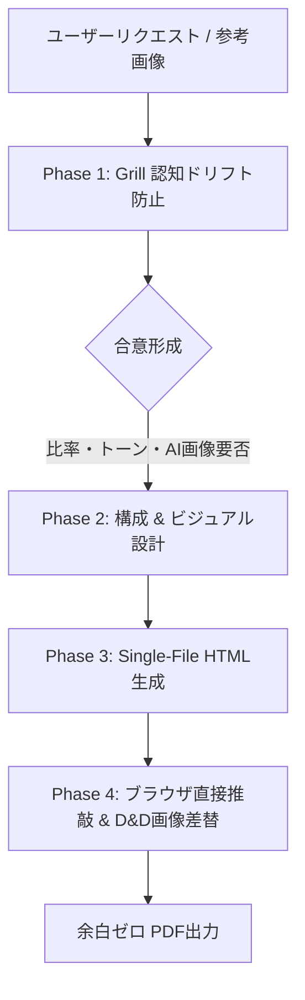

# NativeSlide (Webネイティブ・HTMLスライド生成スキル)

ブラウザ上で直接テキストを推敲・編集でき、1クリックで余白ゼロのピクセルパーフェクトなPDFにエクスポートできる単一HTMLスライド（Single-File HTML）を生成するためのスキルです。

---

## ワークフロー (Workflow)

### Phase 1: Grill（認知ドリフト防止インタビュー）
いきなりHTMLコードを出力せず、まず以下の4大論点について選択肢を提示して合意を形成します。
詳細は [Grillフレームワーク仕様書](./references/grill-workflow.md) を参照。
1. **プレゼンの目的 & ターゲット読者**（役員決裁 / 現場向け / 顧客提案）
2. **アスペクト比 & トーン**（16:9 ワイド or 4:3 スタンダード / モダンテック or 堅実コーポレート）
3. **スライド枚数と構成骨子**（3枚要約 / 5枚標準 / 指定構成）
4. **AI生成画像の要否**（抽象概念・ビジョンを可視化するAI画像枠の配置要否）
※ユーザーが「急ぎ」「おまかせ」「即生成」を求めた場合のみ、デフォルト（16:9、テック系、5枚構成）で即座に出力します。

### Phase 2: 比率判定・デザインシステム・AI画像プロンプト策定
- **アスペクト比の適用**:
  - **16:9（デフォルト）**: `w-[1280px] h-[720px]`、`@page { size: 16in 9in; }`、`.slide { width: 16in; height: 9in; }`
  - **4:3**: `w-[1024px] h-[768px]`、`@page { size: 4in 3in; }`、`.slide { width: 4in; height: 3in; }`
  - 詳細は [比率・印刷CSS仕様書](./references/ratio-and-print-specs.md) を参照。
- **AI生成画像（Concept Imagery）の策定**:
  - 抽象的な概念（データ統合、AI協調、未来ビジョン等）を直感的に表現するための英語プロンプトを設計。
  - 詳細は [AI生成画像仕様書](./references/ai-concept-imagery.md) を参照。
- **堅牢ボックスモデルの適用**:
  - 文字数増減でも要素の重なりや枠突き抜けが物理的に起きない `flex-shrink-0`、`min-h-0`、`flex-col`、`overflow-hidden`。
  - 詳細は [デザインシステム仕様書](./references/design-system.md) を参照。
- **言語の自動切替（Language Auto-Detection & Adaptation）**:
  - **切り替えボタンは配置しない**: UIの煩雑化・肥大化を防ぐため、画面上に手動の言語切り替えボタンは一切設置しません。
  - **依頼が日本語の場合**: `<html lang="ja">` を指定。スライド本文・見出し・要約・発表者名を日本語で作成。
  - **依頼が日本語以外（英語等）の場合**: `<html lang="en">` を指定。スライド本文・見出し・要約・発表者名を英語（English）で作成。
  - **UI側の自動同期**: テンプレート側が `<html lang="...">` 属性を読み取り、目次・ボタン・ツールチップ・プレースホルダー・AI指示コピー書式を自動的に完全英語化します。

### Phase 3: スライドパターン選定とSingle-File HTML生成
テーマに応じて最適なパターンを組み合わせてHTMLを生成します。
詳細は [スライドパターン集](./references/slide-patterns.md) を参照。
- **Cover**: 表紙・タイトル・発表者・機密区分
- **Comparison**: 課題と目指す姿（AS-IS vs TO-BE）
- **Concept Vision**: AI生成画像スプリット（画像ドラッグ＆ドロップ対応枠）
- **Architecture / Feature Cards**: 3〜4列カード（COREレイヤー強調）
- **Roadmap / Timeline**: フェーズ別マイルストーン
- **KPI & Impact**: 巨大数値コールアウトと定性分析

### Phase 4: ブラウザ直接推敲 & コメント・発表メモ入力
- スライドに `contenteditable="true"` を付与し、ブラウザ上で直接テキスト編集可能。
- 選択テキスト直上にミニ書式バーが出現（太字、サイズ変更、カラー、蛍光マーカー）。
- 画像枠はデスクトップからの **ドラッグ＆ドロップで即座に画像差し替え** 可能（`FileReader` 搭載）。
- 各スライド直下に **メタ情報コンテナ（`slide-meta-box`）** を配置し、「💬 修正指示」と「🎤 発表メモ」をタブで切り替え。
- ツールバーの「📋 指示をコピー」または「📥 HTML保存」で、修正指示を即座にエージェントへ共有。

### Phase 5: 反復修正（Iteration with Feedback）
ユーザーからコメント付きHTMLまたは指示テキストを受け取った場合：
1. **差分維持**: 指示のないスライドは、ユーザーが推敲したテキストを100%忠実に維持。
2. **的確な改修**: 指示のあったスライドのみを要望に沿って構成・テキスト・ビジュアル改訂（折り返しの解消、余白調整等も反映）。
3. **コード再出力**: 修正済みの完全なSingle-File HTMLコードブロックを出力し、スライドごとの修正概要を報告。

### Phase 6: 全画面プレゼンテーション & 余白ゼロPDF出力
1. **全画面スライドショー**:
   - `F` キーまたはツールバーの「▶ 発表」ボタンで起動。
   - 画面アスペクト比フィット、`→`/`←`/`Space` 送り、`Esc` 終了。
   - `N` キーで発表メモを画面下部にトグル表示。
   - `L` キーで赤色レーザーポインターを起動。
2. **余白ゼロPDF出力**:
   - ツールバーの「PDF保存」で1スライド1ページの余白ゼロPDFを出力（メタ枠やツールバーは自動除外）。

---

## 出力形式の鉄則 (Single-File HTML)
- すべてのHTML・Tailwind設定・インラインCSS・スクリプトを1ファイルに収めた単一コードブロック（`<!DOCTYPE html>...</html>`）を出力すること。
- 外部依存は以下のみに限定：
  - Tailwind CSS CDN: ``
  - Google Fonts: `Plus Jakarta Sans` & `Noto Sans JP`
- ベーステンプレートは [template_base.html](./resources/template_base.html) を参照。

---

## 実装サンプル (Examples)
- [16:9 サンプルHTML (データ基盤導入計画)](./examples/slide_16_9_example.html)
- [4:3 サンプルHTML (データ基盤導入計画)](./examples/slide_4_3_example.html)
