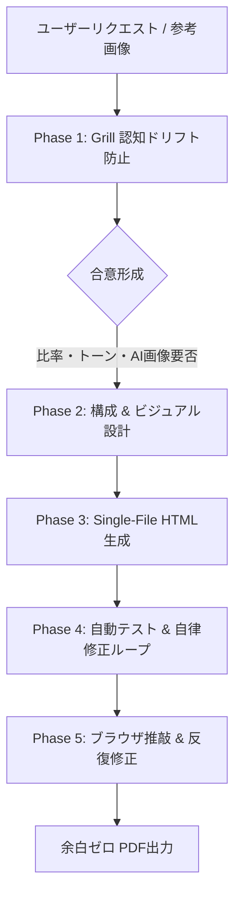

# AINativeSlide (生成AIのための安定・高精度なHTMLスライド出力フレームワーク)

生成AI（LLM）にとって最も記述精度が高い HTML/Tailwind CSS を中間フォーマットとして活用し、レイアウト崩れや文字溢れのない堅牢なスライドを安定出力するためのフレームワークです。
最終的にはブラウザから余白ゼロのピクセルパーフェクトなPDFとしてエクスポートすることを主目的とします。

**なぜ HTML なのか:** `python-pptx` 等によるPPTX直接生成はテキスト溢れやフォント崩れが頻発しますが、LLMはHTML/CSSの知識が深く、CSS Flexboxによる自己修復的なレイアウトにより出力が桁違いに安定します。

---

## ワークフロー (Workflow)



### Phase 1: Grill（認知ドリフト防止インタビュー）
いきなりHTMLコードを出力せず、まず以下の5大論点について選択肢を提示して合意を形成します。
詳細は [Grillフレームワーク仕様書](./references/grill-workflow.md) を参照。
1. **プレゼンの目的 & ターゲット読者**（役員決裁 / 現場向け / 顧客提案 / 稟議・配布資料）
2. **アスペクト比 & トーン**（16:9 ワイド / 4:3 標準 / 【新】A4横（印刷・配布・稟議向け） / 【新】A4縦（企画書・1枚ペーパー） / モダンテック or 堅実コーポレート）
3. **スライド枚数と構成骨子**（3枚要約 / 5枚標準 / 指定構成）
4. **AI生成画像の要否**（抽象概念・ビジョンを可視化するAI画像枠の配置要否）
5. **発表用台本文書（Markdown）の同時生成**（不要 / 【推奨】希望する: `speech_script.md` をセット出力）
※**動的スマートGrill**: ユーザーの依頼文に既に比率や枚数、目的が含まれている場合はオウム返しせず自動確定し、未定の論点のみをピンポイントで確認します。すべて明確な場合は質問を全スキップして直ちに骨子サマリー提示とコード生成へ移行します。
※台本生成が希望された場合、Single-File HTMLスライドと発表台本文書（Markdown）の2成果物をセットで出力します。

### Phase 2: 比率判定・デザインシステム・AI画像プロンプト策定
- **アスペクト比の適用**:
  - **16:9 ワイド（デフォルト）**: `w-[1280px] h-[720px]`、`@page { size: 16in 9in; margin: 0; }`
  - **4:3 スタンダード**: `w-[1024px] h-[768px]`、`@page { size: 4in 3in; margin: 0; }`
  - **A4 横（Landscape - 印刷配布・稟議・役員提案）**: `w-[1188px] h-[840px]`、`@page { size: A4 landscape; margin: 0; }`
  - **A4 縦（Portrait - 企画書・1枚ペーパー・報告書）**: `w-[840px] h-[1188px]`、`@page { size: A4 portrait; margin: 0; }`
  - 詳細は [比率・印刷CSS仕様書](./references/ratio-and-print-specs.md) を参照。
- **AI生成画像（Concept Imagery）の策定**:
  - 抽象的な概念（データ統合、AI協調、未来ビジョン等）を直感的に表現するための英語プロンプトを設計。
  - 詳細は [AI生成画像仕様書](./references/ai-concept-imagery.md) を参照。
- **堅牢ボックスモデルの適用**:
  - 文字数増減でも要素の重なりや枠突き抜けが物理的に起きない `flex-shrink-0`、`min-h-0`、`flex-col`、`overflow-hidden`。
  - 詳細は [デザインシステム仕様書](./references/design-system.md) を参照。
- **AI出力安定化: `ai-content` ラッパーの適用**:
  - スライドの本文コンテンツエリアには `<div class="ai-content">` を配置し、その中は `h2`, `h3`, `p`, `ul`, `li` のみを使用する。
  - CSS側で `-webkit-line-clamp` による強制的な文字溢れ防止が適用され、AIがどれだけ長い文章を出力しても物理的にスライド枠を突き抜けない堅牢性を確保。
  - ユーティリティクラス `line-clamp-1` 〜 `line-clamp-5` も利用可能。
- **言語の自動切替（Language Auto-Detection & Adaptation）**:
  - **切り替えボタンは配置しない**: UIの煩雑化・肥大化を防ぐため、画面上に手動の言語切り替えボタンは一切設置しません。
  - **依頼が日本語の場合**: `<html lang="ja">` を指定。スライド本文・見出し・要約・発表者名を日本語で作成。
  - **依頼が日本語以外（英語等）の場合**: `<html lang="en">` を指定。スライド本文・見出し・要約・発表者名を英語（English）で作成。
  - **UI側の自動同期**: テンプレート側が `<html lang="...">` 属性を読み取り、ボタン・ツールチップ・プレースホルダー・AI指示コピー書式を自動的に完全英語化します。

### Phase 3: スライドパターン選定とSingle-File HTML生成
テーマに応じて最適なパターンを組み合わせてHTMLを生成します。
詳細は [スライドパターン集](./references/slide-patterns.md) を参照。
- **Cover**: 表紙・タイトル・発表者・機密区分（CONFIDENTIAL等）
- **Comparison**: 課題と目指す姿（AS-IS vs TO-BE 対比）
- **Concept Vision**: AI生成画像スプリット（画像ドラッグ＆ドロップ対応枠）
- **Table / Matrix**: 比較評価表・選定マトリクス（推奨列ハイライト、評価バッジ、固定セル余白）
- **Business Chart**: インラインSVGビジネスチャート（棒・折れ線複合、テーマカラー完全連動）
- **Architecture / Feature Cards**: 3〜4列カード（COREレイヤー強調）
- **Roadmap / Timeline**: フェーズ別マイルストーン
- **KPI & Impact**: 巨大数値コールアウトと定性分析

### Phase 4: 自動テストと自律修正ループ (Auto-Verification & Self-Repair)
**※人間がテスト結果を確認する必要はありません。不備があればユーザー提示前にAIが自律修正します。**
1. **検証スクリプトの実行**:
   - HTMLファイルを保存・出力する直前に、必ず以下のコマンドを実行して静的解析を実施します。
     ```bash
     python3 scripts/verify_slide.py <スライドファイルパス>
     ```
2. **検証項目**:
   - スライド枚数とメタ情報ボックス（`slide-meta-box`）の数が1対1で完全一致しているか。
   - スライド番号（`01 / 08` 等）とメタバッジ（`Slide 1 / 8` 等）の連番に欠番や重複がないか。
   - スライドごとの本文文字数が上限（700文字）を超えていないか（720px枠からの文字溢れ・オーバーフロー防止）。
   - 必須UI ID（ヘッダー、モード切替タブ、印刷ゼロマージン）がすべて揃っているか。
3. **エラー検出時の自律修正（Self-Repair）**:
   - 終了コードが `1` の場合、出力された `[ERROR]` 指示を読み取り、**ユーザーに報告する前にAIが自律的にHTMLを修正して再テスト**を実行します。
   - **全テストが合格（Exit Code 0）するまで自律修正ループを繰り返し、100%完璧な状態になって初めてユーザーへ成果物を提示します。**

### Phase 5: ブラウザ直接推敲 & 自動保存・コメント入力
- スライドに `contenteditable="true"` を付与し、ブラウザ上で直接テキスト編集可能（編集モードON/OFF切り替え可能、OFF時は完全選択不可）。
- **LocalStorage 自動保存**: 推敲したテキスト、修正指示はブラウザの `localStorage` にリアルタイム自動保存（誤リロードによる消失ゼロ、ヘッダーからリセットも可能）。
- 選択テキスト直上にミニ書式バーが出現（太字、サイズ変更、蛍光マーカー）。
- 画像枠はデスクトップからの **ドラッグ＆ドロップで即座に画像差し替え** 可能（`FileReader` 搭載）。
- ツールバーの「📋 指示をコピー」で、全スライドの修正指示を一括コピーし、即座にAIへ共有。

### Phase 6: 反復修正（Iteration with Feedback）
ユーザーからコメント付きHTMLまたは指示テキストを受け取った場合：
1. **差分維持**: 指示のないスライドは、ユーザーが推敲したテキストを100%忠実に維持。
2. **的確な改修**: 指示のあったスライドのみを要望に沿って構成・テキスト・ビジュアル改訂（折り返しの解消、余白調整等も反映）。
3. **コード再出力**: 修正済みの完全なSingle-File HTMLコードブロックを出力し、スライドごとの修正概要を報告。

### Phase 7: 余白ゼロPDF出力
- ツールバーの「PDF保存」で1スライド1ページの余白ゼロPDFを出力（メタ枠やツールバーは自動除外）。
- Puppeteer環境がある場合は `node scripts/export_pdf.js <slide.html>` でヘッドレスPDF出力も可能。
- 全画面スライドショー（`F` キー）も利用可能（おまけ機能）。

---

## 出力形式の鉄則 (Single-File HTML)
- すべてのHTML・Tailwind設定・インラインCSS・スクリプトを1ファイルに収めた単一コードブロック（`<!DOCTYPE html>...</html>`）を出力すること。
- 外部依存は以下のみに限定：
  - Tailwind CSS CDN: `<script src="https://cdn.tailwindcss.com"></script>`
  - Google Fonts: `Plus Jakarta Sans` & `Noto Sans JP`
- **ベース構造の参照**:
  - 機能エンジン（UI/JS等）: [template_base.html](./resources/template_base.html)
  - 企業公式デザイン骨格（CIカラー/ロゴ/枠レイアウト）: [corporate_default.html](./resources/design_templates/corporate_default.html)
- **AI出力安定化ルール**:
  - スライド本文は `<div class="ai-content">` で囲み、内部は `h2`, `h3`, `p`, `ul`, `li` のみを使用する（閉じタグ忘れ防止のため深いネストを避ける）。
  - CSSの `line-clamp` により文字溢れが物理的に不可能であることを前提に、テキスト量を適度に抑える。
- ※自社公式PPTXテンプレートの新規取り込み・登録は、初期セットアップ用スキル `ainativeslide-template-builder` を利用すること。

---

## 実装サンプル (Showcase & Templates)
- [16:9 日本語実動デモ (全8スライド・表・チャート完備)](./index.html)
- [発表台本文書サンプル (speech_script_example.md)](./resources/speech_script_example.md)
